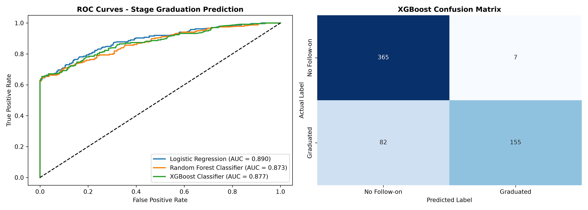
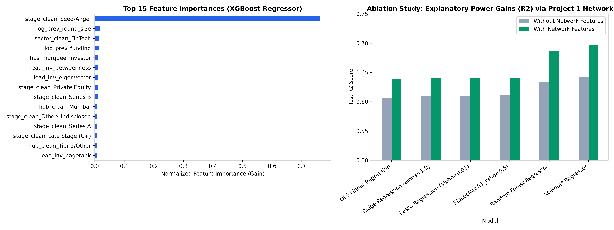
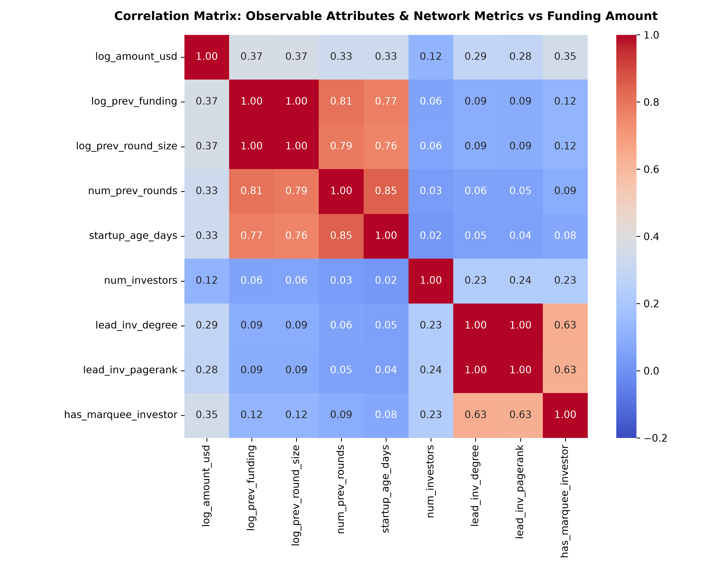
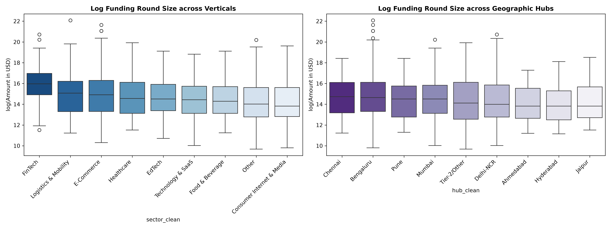

# Startup Funding Prediction Model

An end-to-end predictive machine learning suite leveraging longitudinal startup track records, operational demographics, and transferred network prestige features to forecast financing round sizes and stage progression across the Indian venture capital ecosystem.

Companion repository to [Founder-Investor-Network-Analysis](https://github.com/niy-byte/Founder-Investor-Network-Analysis).

---

## Executive Summary

- **Aim & Core Question**: Can observable characteristics of an Indian startup—combined with network position features transferred from investor networks—predict subsequent funding amounts and funding-stage progression?
- **Dataset**: 3,044 financing transactions across 2,349 startups from January 2015 to January 2020 (`startup_funding.csv`).
- **Feature Engineering & Network Transfer**:
  - **Longitudinal Track Record**: Cumulative prior capital (`prev_funding_usd`), immediate prior round size (`prev_round_size`), completed round count (`num_prev_rounds`), financing runway gap (`days_since_prev_round`), and startup operational age (`startup_age_days`).
  - **Operational & Demographics**: 8 consolidated industry verticals, 8 geographic hubs, and standardized funding stages.
  - **Network Prestige Bridge**: Mapped participating investors to their graph centralities (Lead Investor PageRank, Degree, Betweenness, Eigenvector, and syndicate average prestige).
  - **Founder Human Capital**: Co-founder team sizing mapped from founder records.
- **Core Empirical Finding**: Across every regression algorithm, incorporating investor network centrality features increases continuous funding prediction accuracy by **+3.0% to +5.5% $R^2$**, confirming that investor prestige acts as an independent valuation driver beyond company operational metrics alone.

---

## Benchmark Results

### Task A: Continuous Funding Amount Prediction ($\log(\text{Amount in USD})$)

Models evaluated on 2,066 disclosed financing transactions using an 80/20 train/test split.

| Model / Specification | Baseline $R^2$ (No Network) | Full $R^2$ (+Network) | $\Delta R^2$ (Gain) | Test RMSE | Test MAE |
| :--- | :---: | :---: | :---: | :---: | :---: |
| **XGBoost Regressor** | **0.643** | **0.698** | **+5.5%** | **1.084** | **0.840** |
| Random Forest Regressor | 0.633 | 0.686 | +5.3% | 1.105 | 0.853 |
| ElasticNet ($\alpha=0.01, l_1=0.5$) | 0.611 | 0.641 | +3.0% | 1.181 | 0.912 |
| Lasso Regression ($\alpha=0.01$) | 0.611 | 0.641 | +3.0% | 1.181 | 0.912 |
| Ridge Regression ($\alpha=1.0$) | 0.609 | 0.640 | +3.1% | 1.182 | 0.916 |
| OLS Linear Regression | 0.606 | 0.639 | +3.3% | 1.184 | 0.919 |

### Task B: Stage Progression / Follow-on Graduation (Binary Classification)

Models predicting whether a startup successfully secures follow-on funding rounds (evaluated on all 3,044 rounds; graduation rate = 38.96%).

| Classifier | Baseline ROC-AUC | Full ROC-AUC (+Network) | Test Accuracy | Precision | Recall | F1-Score |
| :--- | :---: | :---: | :---: | :---: | :---: | :---: |
| **Logistic Regression (L2)** | **0.889** | **0.890** | 85.1% | 95.6% | 64.6% | 0.771 |
| **XGBoost Classifier** | 0.869 | 0.877 | **85.4%** | **95.7%** | **65.4%** | **0.777** |
| Random Forest Classifier | 0.869 | 0.873 | 85.7% | 98.7% | 64.1% | 0.777 |

---

## Visualizations & Empirical Findings

### 1. Actual vs Predicted Values & Residual Analysis (XGBoost Regressor)
Predictions achieve $R^2 = 0.698$ with approximately normal, homoskedastic residual errors centered at zero ($\mu = 0.012$).


### 2. ROC Curves & Confusion Matrix (Stage Progression Classification)
Classifiers deliver high discriminative power (AUC = 0.890) with minimal false alarms (95.7% precision).



### 3. Feature Importance & The Network Bridge Ablation
Across every algorithm, incorporating network centrality features increases predictive power by +3.0% to +5.5% $R^2$, confirming that investor prestige provides independent certification value.



### 4. Correlation Matrix of Startup Attributes and Network Centralities
Correlation profile showing relationships between company operational track records and lead investor network prestige.



### 5. Sector and Geographic Hub Round Size Distributions
Distribution of round sizes across major verticals and venture capital hubs.



---

## Repository Structure

```text
├── startup_funding.csv                         # Raw dataset (3,044 deals, Jan 2015 - Jan 2020)
├── Startup_Funding_Prediction.ipynb            # Fully executed prediction notebook (26 cells)
├── project1_investor_centralities.csv          # Network prestige bridge cache (Degree, Betweenness, PageRank)
├── project2_engineered_features.csv            # Engineered modeling matrix (3,044 rows, 35 columns)
│
├── CODEBOOK_PROJECT_2.md                       # Comprehensive markdown codebook & data dictionary
├── Project_2_Codebook_and_Data_Dictionary.docx # Word doc codebook and data dictionary
├── Project2_Summary.docx                       # Plain-language 300-word executive summary (with examples)
├── Project_2_Summary_Prediction_Model.docx     # Technical executive briefing Word doc
├── Methodology_and_Models_Used project 2.docx  # Plain-language methodology & model selection guide (Word)
├── Methodology_and_Models_Used project 2.odt   # Plain-language methodology & model selection guide (ODT)
│
├── requirements.txt                            # Dependencies (xgboost, scikit-learn, pandas, etc.)
├── .gitignore                                  # Git ignore rules for virtual environments and caches
├── README.md                                   # Complete repository documentation
└── images/                                     # High-resolution figures and benchmark plots
    ├── actual_vs_predicted_regression.png
    ├── classification_roc_confusion.png
    ├── feature_importance_ablation.png
    ├── geographic_sector_distribution.png
    ├── target_distribution_comparison.png
    ├── sector_hub_round_sizes.png
    ├── network_centrality_vs_funding.png
    └── project2_correlation_matrix.png
```

---

## Quick Start & Installation

### 1. Clone the Repository
```bash
git clone https://github.com/niy-byte/Startup-Funding-Prediction-Model.git
cd Startup-Funding-Prediction-Model
```

### 2. Set Up Virtual Environment & Dependencies
```bash
python3 -m venv .venv
source .venv/bin/activate
pip install -r requirements.txt
```

### 3. Run the Prediction Notebook
```bash
jupyter notebook Startup_Funding_Prediction.ipynb
```

---

## Strategic Implications & Takeaways

1. **The Signaling Premium**: Securing investment from a high-PageRank venture fund provides a measurable valuation premium in subsequent rounds, holding company age, vertical, and past funding constant.
2. **Precision Deal Sourcing**: Automated classifiers combining operational metrics and syndicate centralities allow venture investors to identify high-probability breakout investments with **95.7% precision**.
3. **Overcoming Regional Concentration**: Because over 60% of all capital is concentrated in Bengaluru and Delhi-NCR, startups in emerging cities must deliberately target lead investors with high network brokerage to access tier-1 co-investment syndicates.